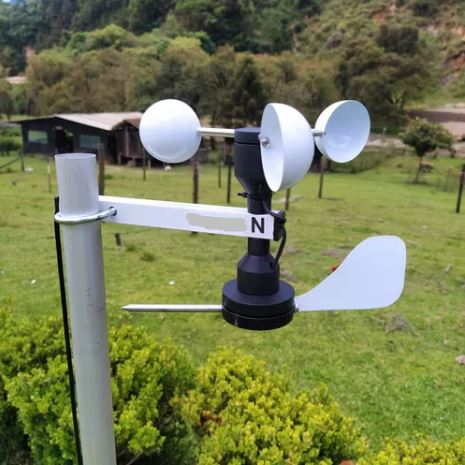

# Anemômetro e direção do vento



```
Comprado da WRF COMERCIAL - CICLUS Estações Meteorológicas

ESPECIFICAÇÕES - Anemômetro:
* "Canecos" em alumínio c/ 50 mm diâmetro
* Suporte em alumínio c/ 200 mm comprimento
* Eixo com rolamento lacrado (livre de manutenção), diâmetro total de 210 mm
* Sensor magnético lacrado
* Cabo manga com 6 metros
* Suporta altas velocidades (+130 km /h)
* Alta sensibilidade, inicia em 0,9 Km/h

ESPECIFICAÇÕES - Biruta
* Sensor resistivo lacrado, protegido contra intempéries.
* Indica N,NE,E,SE,S,SO,O e NO ou 0,45,90,135,180,225,270 e 315 graus.
* Eixo indicador com 200 mm
* Cabo manga com 6 metros
```

```
Adquirido uma placa WT32-ETH01 baseada no ESP32 + Ethernet LAN8720 integrados como
objetivo de criar um monitoramento velocidade do vento e direção retornando em JSON.

Instalado ferramenta do ESP32
pip install esptool

Com um adaptador RS-232 3.3v
WT32-ETH01 é 3.3v, mas tem entrada de 5v que passa por um regulador de 3.3v

Apaga todo conteúdo da flash do W32-ETH0
esptool.py --chip esp32 --port /dev/ttyUSB0 erase_flash
Grava o firmware MicroPython no ESP32 Obs.: O RX e TX tem dois na placa, utilizar o da extremidade.
esptool.py --chip esp32 --port /dev/ttyUSB0 --baud 460800 write_flash -z 0x1000 esp32-20230426-v1.20.0.bin (baixado do www.micropython.com)

Instalado o aplicativo Thonny
Vá em Tools
        Options
          Interpreter
            Selecione MicroPython (ESP32)
            Selecione o dispositivo serial
A partir daí copiar os código para o módulo
```

```
Cabo manga do anemômetro e direção do vento:

  Preto      Vermelho Verde      Amarelo
    |           |       |           |
    |           +---+---+           |
    +-----+         |         +-----|
    |     \         |         \     |
    |     / 10K     |    4.7K /     |
    |     \         |         \     |
    |     +         |         +     |
    |     |         |         |     |
    |     |         °         |     |
    °     °        3.3V       °     °
   Pin   GND                 GND   Pin
   35                             4 ADC
   RPM                            Direção

```
60RPM = 1.81KM/h (r=80mm)
